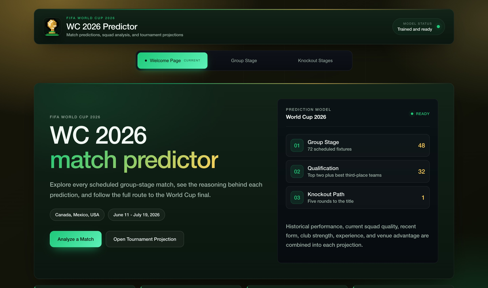
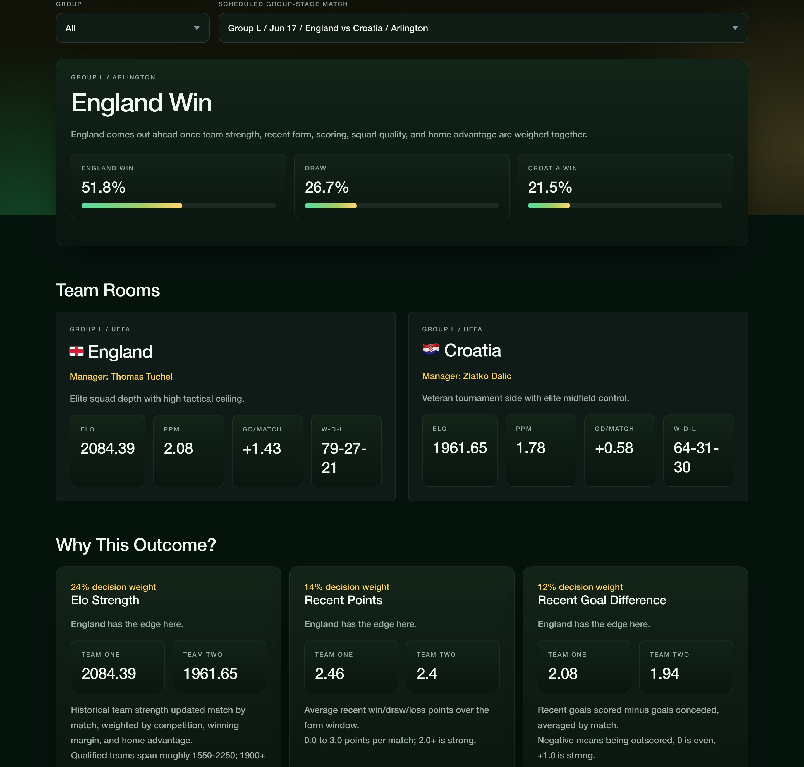
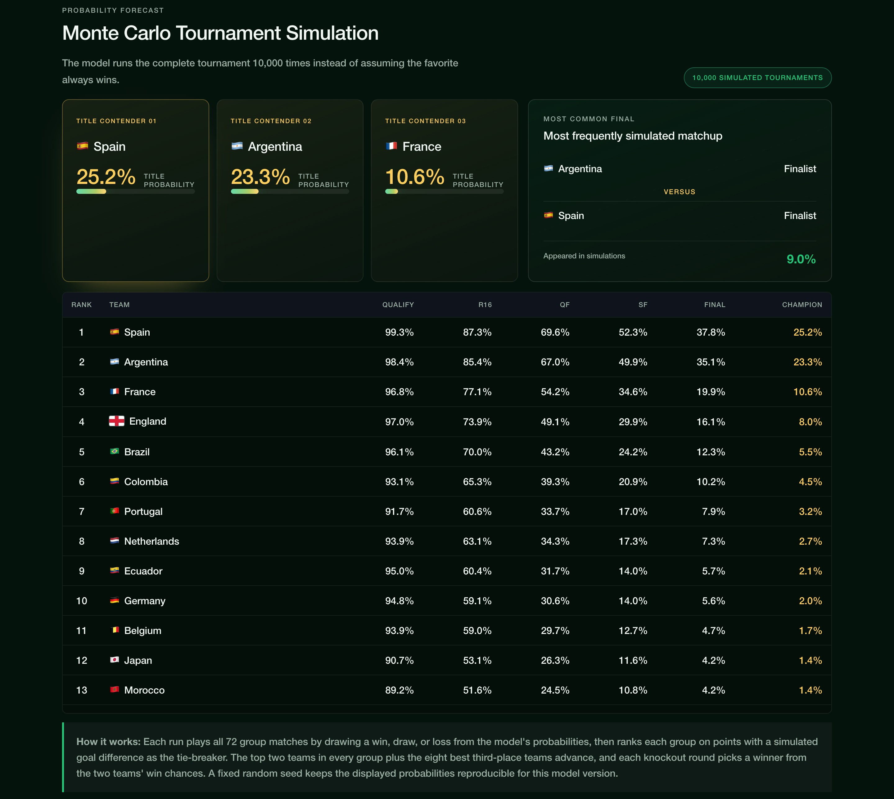

# WC 2026 Predictor

This is a project I built to predict how the 2026 World Cup might play out. It uses real international results from the last 10 years, current squad info, and a machine learning model to work out who is likely to win each game, from the group stage all the way to the final.

It runs as a small website (built with FastAPI) where you can pick any group-stage match and see the prediction, the reasoning behind it, both squads, and recent form. There is also a knockout page that simulates the whole tournament thousands of times to show each team's chances.

## Live site

[MatchMind26](https://matchmind26.onrender.com)

## What it looks like

The site has three pages: a welcome overview, the group-stage match reports, and the knockout projection. They all use the same model and data.

**Welcome page**



**Group-stage match report**, pick a fixture and see the prediction, both teams, and the reasoning behind it.



**Knockout projection**, the full tournament simulated 10,000 times, with each team's odds.



## What it does

- Pick any of the 72 scheduled group-stage matches and get a win/draw/loss prediction with a projected score.
- See why the model picked a result, Elo strength, recent form, squad attack and defense, experience, club strength, and home advantage, each with how much it counts.
- Browse the full squad and player ratings for every team.
- Project the whole knockout bracket: group standings, the 32 qualifiers, scorelines, and a champion.
- Run the tournament 10,000 times (Monte Carlo) to get each team's odds of reaching every round and winning it all.
- JSON API endpoints, so you can pull predictions programmatically.
- Tests for the data, features, model, and simulation.

## Built with

- Python, pandas, and NumPy
- XGBoost for the win/draw/loss model
- scikit-learn for the goal models and evaluation
- FastAPI and Uvicorn for the website and API
- Plain HTML, CSS, and JavaScript for the front end
- pytest and Ruff

## How the project is laid out

```text
worldcup26-predictor/
  artifacts/            trained model file (built locally or on deploy)
  assets/
    screenshots/        images used in this README
    site_icon.png       site icon
  data/
    sample/             the datasets the app and tests use
    raw/                full downloaded match history
  src/wc26_predictor/
    api/
      web/              the front end: index.html, styles.css, app.js
      main.py           routes and API endpoints
    data/               loading and building the match data
    features/           feature engineering and Elo
    models/             training, evaluation, and prediction
  tests/                tests
```

## The front end

The website is plain HTML, CSS, and JavaScript kept in `src/wc26_predictor/api/web/`:

- `index.html`, the page layout
- `styles.css`, all of the styling
- `app.js`, fetches data from the API and builds each view

FastAPI serves `index.html` at `/`, serves the CSS and JS from `/static`, and exposes the prediction and tournament data as JSON. So one server runs both the site and the API.

## Running it yourself

Set up a virtual environment and install the project:

```bash
python3 -m venv .venv
source .venv/bin/activate
pip install -e ".[dev,app]"
```

Run the tests:

```bash
pytest
```

Train the model:

```bash
python -m wc26_predictor.models.train \
  --matches data/raw/international_results.csv \
  --squads data/sample/squads.csv \
  --qualified-teams data/sample/qualified_teams.csv \
  --model-out artifacts/model.joblib
```

Predict a single match from the command line:

```bash
python -m wc26_predictor.models.predict \
  --model artifacts/model.joblib \
  --home "United States" \
  --away "England"
```

Start the website:

```bash
uvicorn wc26_predictor.api.main:app --reload
```

Then open `http://127.0.0.1:8000`.

## The data

Everything runs locally with the included CSV files, no paid APIs. The match history covers the last 10 years of international games for the 2026 teams (competitive matches and friendlies). Squad data is in CSV files, so it is easy to update as rosters change.

Rebuild the match data:

```bash
python -m wc26_predictor.data.build_matches \
  --qualified-teams data/sample/qualified_teams.csv \
  --output data/sample/matches.csv \
  --raw-output data/raw/international_results.csv \
  --start-date 2016-06-10 \
  --end-date 2026-06-10
```

Main files:

- `group_stage_fixtures.csv`, the scheduled group matches
- `matches.csv`, match history used for training
- `qualified_teams.csv`, the 48 teams and their groups
- `worldcup_squads_26.csv`, player rosters shown in the app
- `team_metadata.csv`, managers, confederation, and notes
- `fifa_rankings.csv`, dated FIFA world rankings (team, date, points) used for the ranking feature

### Where the data comes from

- **Match history**, the [martj42/international_results](https://github.com/martj42/international_results) repo on GitHub, which keeps a CSV of every international men's match since 1872. The `build_matches` script pulls the live file and trims it to the last 10 years of games involving 2026 qualifiers.
- **FIFA rankings**, the [Dato-Futbol/fifa-ranking](https://github.com/Dato-Futbol/fifa-ranking) repo, which scraped FIFA's website for the historical ranking points published from 1992 onward.
- **Squads, fixtures, qualified teams, and manager metadata**, built by hand from the official FIFA fixture list and public roster information, then kept in CSV files so they are easy to update as rosters change.

## How the model works

It predicts one of three results for each match: home win, draw, or away win.

It looks at:

- Elo team strength built from past results. World Cup games count more than friendlies, bigger wins move the rating more, and there is a correction so home wins are not over-rewarded.
- The FIFA ranking gap between the two teams, using each team's ranking *as of the match date* so older games only see the ranking that existed back then.
- Recent points and goal difference.
- Squad attack, defense, experience, and club strength.
- A small home-advantage bonus for the three host nations.

Team names from the source data are converted to the official 2026 names (for example Turkey to Turkiye) so each team keeps its full history.

The main model is XGBoost, with the draw threshold tuned on a 2024 validation set. The final numbers are only measured on matches from 2025 onward, which are never used for tuning, so they are a fair test. Current squad ratings are kept out of the historical training, using a 2026 squad on old games would be cheating, and are added only as a small adjustment at the end. Separate Poisson goal models estimate the scorelines.

### Tournament simulation

The knockout page runs the full tournament 10,000 times instead of showing one fixed bracket. From those runs it shows:

- each team's chance of finishing 1st to 4th in its group and qualifying
- chances of reaching the Round of 16, quarterfinals, semifinals, and final
- title odds for every team
- the most common final
- a full bracket with projected scores and confidence

### Latest test results

Measured on 1,313 matches from 2025 up to the day before the World Cup (June 10, 2026), including the pre-tournament friendlies:

- Accuracy: **57.2%**
- Draw recall: **43.4%**
- Macro F1: **0.532**
- Log loss: **0.832**
- Brier score: **0.162**
- Calibration error: **4.1%**
- Baseline (always pick the most common result): **48.7%**

The model beats the baseline.

### What helped and what didn't

I tested several ideas the proper way tuning only on the 2024 validation set and judging each on the untouched 2025-2026 test set.

**Added it because it helped:** a dated FIFA ranking feature. Each match uses the two teams' ranking gap *as of the day it was played*, so there is no future-data leakage. It pushed draw recall up the most (about +4 points) and nudged accuracy and log loss in the right direction, so it earned a place in the model.

**Tried but left out, because they didn't help on the test set:**

- **Probability calibration and a Poisson score-model blend**, they lowered the 2024 validation loss but made the 2025-2026 test numbers slightly worse, a classic sign of overfitting the validation data. The model was already well-calibrated, so there was little to fix.
- **A small hyperparameter search**, it picked deeper trees that looked better on validation but generalized worse on the test set, so the original shallow, well-regularized settings won.

The takeaway: for international football, around 57% accuracy with a log loss near 0.83 is close to the realistic ceiling. Even bookmakers land in a similar range, so I would rather report honest numbers than overfit them.

## Deploying

It is a normal Python web app, so it runs on anything that hosts long-running Python services (Render, Railway, Fly.io, and similar).

### Render

The `render.yaml` file does the whole build: install the dependencies, train the model from the included data, then start the server. The trained model is not committed because it is rebuilt on deploy.

Live: [https://matchmind26.onrender.com](https://matchmind26.onrender.com)

## Improvements to make

- SHAP or permutation importance for clearer explanations
- An automated pipeline for player ratings instead of maintaining them by hand
- A cleaner production setup for shipping the trained model
